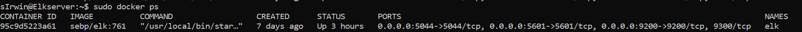

# ELK-Stack-Project_1-main

The files in this repository were used to configure the network depicted below.

These files have been tested and used to generate a live ELK deployment on Azure. They can be used to either recreate the entire deployment pictured above. Alternatively, select portions of the yml and config file may be used to install only certain pieces of it, such as Filebeat.

  - [Pentest](ELK-Stack-Project_1/Ansible_1/pentest.yml)
  - [ansible.cfg](ELK-Stack-Project_1/Ansible_1/ansible.cfg)
  - [install-elk](ELK-Stack-Project_1/Ansible_1/install-elk.yml)
  - [hosts](ELK-Stack-Project_1/Ansible_1/hosts)
  - [filebeat-playbook](ELK-Stack-Project_1/Ansible_1/filebeat-playbook.yml)
  - [metricbeat-playbook](ELK-Stack-Project_1/Ansible_1/metricbeat-playbook.yml)

This document contains the following details:
- Description of the Topology
- Access Policies
- ELK Configuration
  - Beats in Use
  - Machines Being Monitored
- How to Use the Ansible Build

### Description of the Topology

The main purpose of this network is to expose a load-balanced and monitored instance of DVWA, the D*mn Vulnerable Web Application.

Load balancing ensures that the application will be highly available, in addition to restricting unauthortized access to the network.
- Load balancers are then responsible for efficiently distributing the incoming network traffic to various servers in the network.  They help mitigate DDOS attacks.
- Jumpbox allows us to manage VMs without exposing them  the public, creating a barrier and another level of security 

Integrating an ELK server allows users to easily monitor the vulnerable VMs for changes to the virtual network and system logs.
- Filebeat collects log events.  Documents any changes in files or locations
- Metricbeat looks for service metrics to monitor performance 

The configuration details of each machine may be found below.
| Name      | Function                  | IP Address (public) | IP Address (Private) | Operating System     |
|-----------|---------------------------|---------------------|----------------------|----------------------|
| Jump Box  | Gateway                   | 10.1.0.5            | 20.213.153.50        | Linux (ubunto 18.04) |
| Web1      | Web Server/DVWA Container | 10.1.0.7            | 52.187.239.19        | Linux (ubunto 20.04) |
| Web2      | Web Server/DVWA Container | 10.1.0.8            | 52.187.239.19        | Linux (ubunto 20.04) |
| ElkServer | Monitoring/Log Gathering  | 10.2.0.5            | 20.80.182.77         | Linux (ubunto 20.04) |

### Access Policies

The machines on the internal network are not exposed to the public Internet. 

Only the Jump Box machine can accept connections from the Internet. Access to this machine is only allowed from the following IP addresses:
- Rule 4095 SSH1 Port 22 Protocol TCP Source (my private IP)

Machines within the network can only be accessed by the Jump Box.
- The Elk VM can be accessed via SSH from the Jump Box

A summary of the access policies in place can be found in the table below.

| Name       | Publicly Accessible | Allowed IP Address         |
|------------|---------------------|----------------------------|
| Jump Box   | Yes                 | TCP Source (my private IP) |
|  Web1      | No                  | 10.1.0.5                   |
|  Web2      | No                  | 10.1.0.5                   |
|  ElkServer | No                  | 10.1.0.5                   |

### Elk Configuration

Ansible was used to automate configuration of the ELK machine. No configuration was performed manually, which is advantageous because...
- of its efficiency in terms of scalibility when needing to configure multiple machines

The playbook implements the following tasks:
- Install docker.io, python3, and pip3
- Increase virtual memory
- Download image and launch container
- Enable Docker

The following screenshot displays the result of running `docker ps` after successfully configuring the ELK instance.

### Target Machines & Beats
This ELK server is configured to monitor the following machines:
- Web1 10.1.0.7
- Web1 10.1.0.8

We have installed the following Beats on these machines:
- Metricbeat
- Filebeat

These Beats allow us to collect the following information from each machine:
- **Filebeat** collects data about the file system.

- **Metricbeat** collects machine metrics, such as uptime.

### Using the Playbook
In order to use the playbook, you will need to have an Ansible control node already configured. Assuming you have such a control node provisioned: 

SSH into the control node and follow the steps below:
- Copy the elk-playbook.yml file to /etc/ansible/.
- Update the hosts file to include the remote users and ports
- Run the playbook, and navigate to http://20.80.182.77:5601/app/kibana#/home to check that the installation worked as expected.

- download the ***-config.yml and copy it /etc/ansible
- Update the ***-config.yml to influde the Elkserver private IP then run ansible-playbook filebeat-playbook.yml
- http://20.80.182.77:5601/app/kibana#/home

| Commands used                 | desc                                      |
|-------------------------------|-------------------------------------------|
| ssh-keygen                    | create a ssh key for setup VM's           |
| sudo cat .ssh/id_rsa.pub      | to view the ssh public key                |
| ssh sIrwin@0.0.0.0.0          | to log into the Jump Box                  |
| sudo docker container list -a | list all containers                       |
| sudo docker ps -a             | list containers                           |
| sudo docker attach            |                                           |
| sudo docker start             |                                           |
| cd /etc/ansible               | Change directory to the Ansible directory |
| ansible-playbook              | run the playbook                          |
| exit                          | exit                                      |
| nano /etc/ansible/ansible.cfg | edit the ansible.cfg file                 |
| nano /etc/ansible/hosts       | edit the hosts file                       |
| nano /etc/ansible/pentest.yml | edit the pentest file                     |
| sudo apt install docker.io    | install docker application                |
| sudo service docker start     | start the docker application              |
| sudo systemctl status docker  | status of the docker application          |
| ansible -m ping all           | ping ansible connections                  |
| curl -L -O                    | download a web file                       |
| dpkg -i                       | install a file                            |
| nano playbook.yml             | write YAML file                           |
| nano ***config.yml            | write the YAML config file                |
|                               |                                           |
